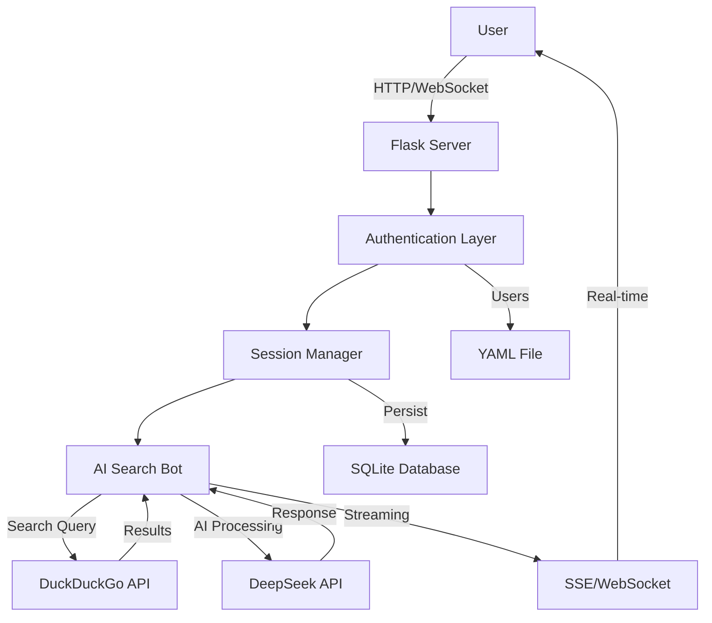

# 🔍 AI Search Bot - Intelligent Web Search Assistant

<div align="center">
  
  
  
  <h3>🤖 Powered by DeepSeek AI & DuckDuckGo - Real-time Intelligent Search</h3>
  
  [](https://python.org)
  [](https://flask.palletsprojects.com/)
  [](https://www.deepseek.com/)
  [](https://www.sqlite.org/)
  [](https://socket.io/)
  [](LICENSE)
  
  <p align="center">
    <a href="#-features">Features</a> •
    <a href="#-demo">Demo</a> •
    <a href="#-quick-start">Quick Start</a> •
    <a href="#-api-documentation">API</a> •
    <a href="#-architecture">Architecture</a> •
    <a href="#-contributing">Contributing</a>
  </p>

  
  
  
</div>

---

## 📋 Table of Contents

- [About](#-about)
- [Features](#-features)
- [Demo](#-demo)
- [Requirements](#-requirements)
- [Quick Start](#-quick-start)
- [Configuration](#-configuration)
- [Usage](#-usage)
- [API Documentation](#-api-documentation)
- [Architecture](#-architecture)
- [Security](#-security)
- [Contributing](#-contributing)
- [Roadmap](#-roadmap)
- [License](#-license)

## 🎯 About

**AI Search Bot** is a cutting-edge web application that combines the power of DeepSeek AI with real-time web search capabilities. It provides an intelligent conversational interface that can search the web, analyze results, and provide comprehensive answers with proper citations.

### 🌟 Key Highlights

- **🧠 Intelligent Search**: AI-powered search intent extraction and result analysis
- **⚡ Real-time Streaming**: SSE and WebSocket support for instant responses
- **🔐 Multi-user System**: Complete authentication with role-based access control
- **📊 Admin Dashboard**: Comprehensive statistics and user management
- **📄 Export Options**: Download conversations as Markdown or PDF
- **🌐 Web Integration**: Seamless DuckDuckGo integration for current information
- **💾 Persistent Storage**: SQLite database for reliable data storage

## ✨ Features

### 🤖 AI-Powered Intelligence
- **Smart Query Analysis**: Automatically determines if web search is needed
- **Contextual Understanding**: Maintains conversation history for better responses
- **Citation System**: Properly cites sources with numbered references
- **Streaming Responses**: Real-time response generation with progress indicators

### 🔍 Advanced Search Capabilities
- **DuckDuckGo Integration**: Privacy-focused web search
- **Smart Filtering**: Region-specific and safe search options
- **Result Analysis**: AI processes and synthesizes search results
- **Source Attribution**: Clear citation of information sources

### 👥 User Management
- **Authentication System**: Secure login with session management
- **Role-Based Access**: Admin and regular user roles
- **User Administration**: Create, update, and manage users
- **Activity Tracking**: Monitor user sessions and interactions

### 💼 Admin Features
- **Dashboard Analytics**: Real-time statistics and metrics
- **User Management**: Complete CRUD operations for users
- **System Monitoring**: Track sessions, messages, and activity
- **Export Controls**: Manage data export permissions

### 🎨 Modern Interface
- **Responsive Design**: Works seamlessly on all devices
- **Real-time Updates**: Live message streaming
- **Dark Mode Ready**: Eye-friendly interface design
- **Markdown Rendering**: Beautiful formatting for responses

## 🎮 Demo

<div align="center">

### 💬 Intelligent Conversation Flow
```
User: "What are the latest developments in quantum computing?"

AI: "I'll search for the latest information on quantum computing developments...

Based on recent search results, here are the latest developments in quantum computing:

## Recent Breakthroughs [1][2]

1. **IBM's 433-qubit Osprey Processor** [1]
   - Announced in November 2023
   - More than triple the qubits of their previous Eagle processor
   
2. **Google's Error Correction Milestone** [2]
   - Achieved quantum error correction below threshold
   - Published in Nature, showing path to practical quantum computers

[Additional detailed information with citations...]

**Sources:**
[1] IBM Quantum Network - "IBM Unveils 433-Qubit Osprey"
[2] Nature - "Quantum Error Correction Below Threshold"
```

### 📊 Admin Dashboard Preview


</div>

## 📋 Requirements

### System Requirements
- Python 3.8 or higher
- SQLite3
- 1GB RAM minimum
- 500MB disk space

### Core Dependencies
```python
Flask>=2.0.0
flask-socketio>=5.0.0
flask-login>=0.6.0
flask-cors>=3.0.0
openai>=1.0.0              # For DeepSeek API
duckduckgo-search>=3.9.0
python-dotenv>=0.19.0
PyYAML>=6.0
markdown>=3.4
```

### Optional Dependencies
```python
reportlab>=3.6.0           # For PDF export
werkzeug>=2.0.0           # Security features
```

## 🚀 Quick Start

### 1. Clone the Repository
```bash
git clone https://github.com/yourusername/ai-search-bot.git
cd ai-search-bot
```

### 2. Set Up Virtual Environment
```bash
# Create virtual environment
python -m venv venv

# Activate it
# Windows:
venv\Scripts\activate
# Linux/Mac:
source venv/bin/activate
```

### 3. Install Dependencies
```bash
pip install -r requirements.txt

# For PDF export support (optional):
pip install reportlab
```

### 4. Configure Environment
```bash
# Copy example environment file
cp .env.example .env

# Edit .env with your settings
nano .env  # or use your preferred editor
```

### 5. Run the Application
```bash
python app.py
```

Access the application at `http://localhost:5005`

## ⚙️ Configuration

### Environment Variables (.env)
```env
# DeepSeek API Configuration
DEEPSEEK_API_KEY=your_deepseek_api_key_here

# Security
SECRET_KEY=your_secret_key_here_generate_with_secrets

# Database (optional, defaults to chat_sessions.db)
DATABASE_PATH=chat_sessions.db

# Server Configuration
HOST=0.0.0.0
PORT=5005
DEBUG=False

# Session Configuration
SESSION_LIFETIME_DAYS=7
```

### Getting DeepSeek API Key
1. Visit [DeepSeek Platform](https://platform.deepseek.com/)
2. Create an account or sign in
3. Navigate to API Keys section
4. Generate a new API key
5. Copy and paste into `.env` file

### Initial Setup
```yaml
# Default admin credentials (users.yaml)
users:
  admin:
    email: admin@example.com
    password: admin123  # ⚠️ CHANGE THIS!
    role: admin
    active: true
```

## 💻 Usage

### Accessing the Application

| Interface | URL | Description |
|-----------|-----|-------------|
| 🔍 Search Chat | http://localhost:5005 | Main chat interface |
| 🔐 Login | http://localhost:5005/login | User authentication |
| 👥 Admin Panel | http://localhost:5005/admin | User management (admin only) |

### Basic Operations

#### 1. Starting a Conversation
- Click "Nova Conversa" or press `Ctrl+N`
- Type your question
- AI will determine if web search is needed
- View real-time response generation

#### 2. Forcing Web Search
- Use the search button 🔍 next to send
- Or prefix your message with `/search`
- Example: `/search latest AI news`

#### 3. Exporting Conversations
- Click the export button in the chat
- Choose format: Markdown or PDF
- File downloads automatically

#### 4. Managing Sessions
- View all sessions in the sidebar
- Click to switch between conversations
- Delete old sessions with the trash icon

## 🔌 API Documentation

### Authentication Endpoints

#### Login
```http
POST /api/auth/login
Content-Type: application/json

{
  "username": "user@example.com",
  "password": "password123",
  "remember": true
}
```

#### Logout
```http
POST /api/auth/logout
Authorization: Bearer <token>
```

### Chat Endpoints

#### Create Session
```http
POST /api/sessions
Authorization: Bearer <token>

{
  "title": "Quantum Computing Research"
}
```

#### Stream Chat (SSE)
```http
POST /api/chat/stream
Authorization: Bearer <token>
Content-Type: application/json

{
  "session_id": "uuid-here",
  "message": "Tell me about quantum computing"
}
```

Response (Server-Sent Events):
```
event: connected
data: {"status": "Conexão estabelecida"}

event: status
data: {"message": "Analisando sua pergunta..."}

event: search_results
data: {"query": "quantum computing", "results": [...]}

event: response_chunk
data: {"chunk": "Quantum computing is...", "message_id": "uuid"}

event: done
data: {"status": "Concluído"}
```

### Admin Endpoints

#### List Users
```http
GET /api/admin/users
Authorization: Bearer <admin-token>
```

#### Create User
```http
POST /api/admin/users
Authorization: Bearer <admin-token>

{
  "username": "newuser",
  "email": "newuser@example.com",
  "password": "secure_password",
  "role": "user"
}
```

#### System Statistics
```http
GET /api/admin/stats
Authorization: Bearer <admin-token>
```

### Export Endpoints

#### Export Session
```http
GET /api/sessions/<session_id>/export/<format>
Authorization: Bearer <token>

Formats: markdown, pdf
```

## 🏗️ Architecture

### System Overview
```
ai-search-bot/
│
├── 📄 app.py                    # Main application file
├── 📄 requirements.txt          # Python dependencies
├── 📄 .env.example             # Environment variables template
├── 📄 users.yaml               # User database (YAML)
├── 📄 chat_sessions.db         # SQLite database
│
├── 📁 templates/               # HTML templates
│   ├── index.html             # Main chat interface
│   ├── login.html             # Authentication page
│   ├── admin.html             # Admin dashboard
│   └── 404.html               # Error page
│
├── 📁 static/                  # Static assets
│   ├── css/                   # Stylesheets
│   ├── js/                    # JavaScript files
│   └── img/                   # Images and icons
│
└── 📁 exports/                 # Exported conversations
```

### Data Flow Architecture


### Database Schema

#### Sessions Table
```sql
CREATE TABLE sessions (
    id TEXT PRIMARY KEY,
    user_id TEXT NOT NULL,
    title TEXT NOT NULL,
    created_at TEXT NOT NULL,
    updated_at TEXT NOT NULL,
    message_count INTEGER DEFAULT 0
);
```

#### Messages Table
```sql
CREATE TABLE messages (
    id TEXT PRIMARY KEY,
    session_id TEXT NOT NULL,
    user_id TEXT NOT NULL,
    role TEXT NOT NULL,
    content TEXT NOT NULL,
    timestamp TEXT NOT NULL,
    search_results TEXT,
    FOREIGN KEY (session_id) REFERENCES sessions(id)
);
```

## 🔒 Security

### Built-in Security Features
- ✅ Password hashing with Werkzeug
- ✅ Session management with Flask-Login
- ✅ CSRF protection
- ✅ Input sanitization
- ✅ SQL injection prevention
- ✅ Role-based access control

### Security Best Practices
1. **Change default credentials immediately**
2. **Use strong SECRET_KEY in production**
3. **Enable HTTPS in production**
4. **Regular backup of database**
5. **Monitor admin activities**
6. **Keep dependencies updated**

### Production Deployment
```nginx
# Nginx configuration example
server {
    listen 443 ssl http2;
    server_name yourdomain.com;
    
    ssl_certificate /path/to/cert.pem;
    ssl_certificate_key /path/to/key.pem;
    
    location / {
        proxy_pass http://localhost:5005;
        proxy_http_version 1.1;
        proxy_set_header Upgrade $http_upgrade;
        proxy_set_header Connection "upgrade";
        proxy_set_header X-Real-IP $remote_addr;
        proxy_set_header X-Forwarded-For $proxy_add_x_forwarded_for;
        proxy_set_header X-Forwarded-Proto $scheme;
        
        # SSE specific
        proxy_buffering off;
        proxy_cache off;
        proxy_read_timeout 86400s;
    }
}
```

## 🤝 Contributing

We welcome contributions! Please see our [Contributing Guidelines](CONTRIBUTING.md) for details.

### How to Contribute
1. Fork the repository
2. Create your feature branch (`git checkout -b feature/AmazingFeature`)
3. Commit your changes (`git commit -m 'Add some AmazingFeature'`)
4. Push to the branch (`git push origin feature/AmazingFeature`)
5. Open a Pull Request

### Development Setup
```bash
# Install development dependencies
pip install -r requirements-dev.txt

# Run tests
pytest

# Run linting
flake8 app.py

# Format code
black app.py
```

### Areas for Contribution
- 🎨 **UI/UX**: Improve the web interface
- 🔍 **Search**: Add more search engines
- 🤖 **AI Models**: Support for other AI providers
- 🌍 **i18n**: Add multi-language support
- 📱 **Mobile**: Responsive improvements
- 🧪 **Testing**: Increase test coverage
- 📚 **Documentation**: Improve docs

## 🗺️ Roadmap

### Version 1.1 (Q1 2024)
- [ ] Google Search integration
- [ ] Bing Search support
- [ ] Voice input/output
- [ ] Mobile app (React Native)
- [ ] Redis caching layer

### Version 1.2 (Q2 2024)
- [ ] Multiple AI model support (GPT-4, Claude, etc.)
- [ ] Advanced admin analytics
- [ ] Team collaboration features
- [ ] API rate limiting
- [ ] Webhook integrations

### Version 2.0 (Q3 2024)
- [ ] Plugin system
- [ ] Custom search engines
- [ ] Knowledge base integration
- [ ] Advanced RAG implementation
- [ ] Enterprise features

## 📊 Performance Metrics

| Metric | Value |
|--------|-------|
| Response Time | < 1s first token |
| Concurrent Users | 100+ |
| Search Latency | < 500ms |
| Database Size | ~1MB per 1000 msgs |
| Memory Usage | < 200MB |

## 🛠️ Troubleshooting

### Common Issues

#### DeepSeek API Error
```
Error: Invalid API key
Solution: Check your DEEPSEEK_API_KEY in .env file
```

#### Database Locked
```
Error: database is locked
Solution: Ensure only one instance is running
```

#### WebSocket Connection Failed
```
Error: WebSocket connection failed
Solution: Check firewall settings and proxy configuration
```

### Debug Mode
```bash
# Enable debug mode for detailed logs
DEBUG=True python app.py
```

## 📄 License

This project is licensed under the MIT License - see the [LICENSE](LICENSE) file for details.

## 👥 Team & Credits

<table>
  <tr>
    <td align="center">
      <a href="https://github.com/yourusername">
        
        <br />
        <sub><b>Your Name</b></sub>
      </a>
      <br />
      <a href="#" title="Code">💻</a>
      <a href="#" title="Documentation">📖</a>
      <a href="#" title="Design">🎨</a>
    </td>
  </tr>
</table>

## 🙏 Acknowledgments

- [DeepSeek](https://www.deepseek.com/) for the powerful AI API
- [DuckDuckGo](https://duckduckgo.com/) for privacy-focused search
- [Flask](https://flask.palletsprojects.com/) for the amazing web framework
- [Socket.IO](https://socket.io/) for real-time capabilities
- Open source community ❤️

---

<div align="center">
  
  **[⬆ Back to top](#-ai-search-bot---intelligent-web-search-assistant)**
  
  Made with ❤️ and 🔍 by the AI Search Bot Team
  
  [](https://github.com/yourusername/ai-search-bot)
  [](https://github.com/yourusername/ai-search-bot/fork)
  
</div>
